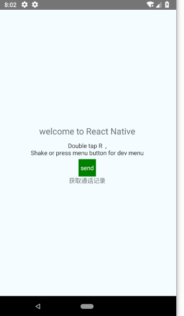
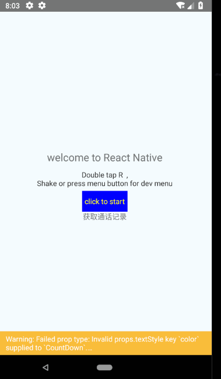

# react-native-zyCountDown
用于react-native的计数组件，倒计时组件

  封装的一个倒计时按钮,仅仅使用TouchableOpacity，View和Text.  <br/>
  
  



## 安装
`npm i react-native-zycountdown`
#####   或者
`yarn add react-native-zycountdown`

##使用
两个使用方式样式分别对应上面两张图片
```
import CountDown from 'react-native-zycountdown';
...

<CountDown
    onClick={() => {
    ToastAndroid.show('Start counting',ToastAndroid.SHORT);
    return true}}
/>

<CountDown
    style={{backgroundColor: 'blue'}}
    textStyle={{color: 'yellow'}}
    count={10}
    title={'click to start'}
    frontText={'frontText:'}
    behindText={'behindText'}
    onClick={() => {
    ToastAndroid.show('Start counting',ToastAndroid.SHORT);
    return true}}
/>
```

## 属性：
| Prop | Type | Default | Description
| ---------- | :-----------:         |:---------------:| -----------|
| style      | ViewPropTypes.style |{alignItems: 'center',justifyContent: 'center',paddingHorizontal: 5,height: 40,backgroundColor:'green'}              |组件的样式 
| textStyle      | ViewPropTypes.style               |  { color: '#fff'}               |文字的样式 
| onClick  | func   | -               |点击组件时触发的方法，返回true则触发计数，返回false则不触发计数
| count  | number   | 60               |初始数字
| title  | string   | send'              |未计时的时候显示的文字
| frontText  | string   | '等待'               |计数时数字左面的数字，用于计数时显示，可设为空字符串
| behindText  | string   | '秒'               |计数时数字右面的数字，用于计数时显示，可设为空字符串
