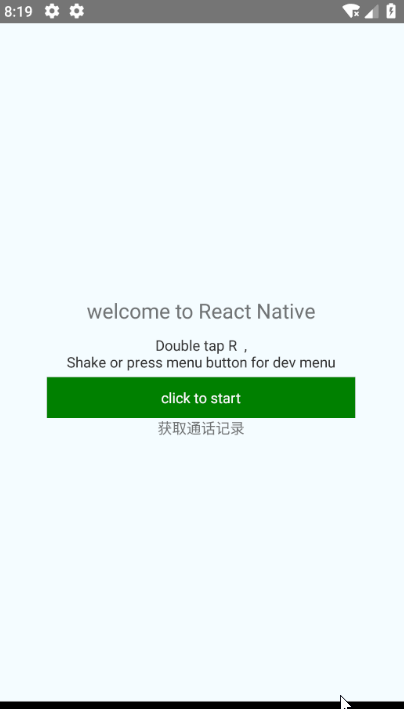
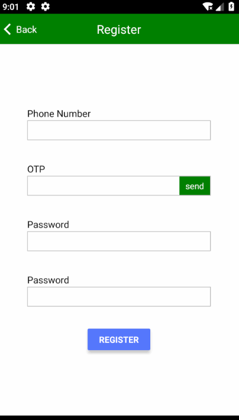

# react-native-zyCountDown
用于react-native的计数组件，倒计时组件

  封装的一个倒计时按钮,仅仅使用TouchableOpacity，View和Text.  <br/>
  



## 安装
`npm i react-native-zycountdown`
#####   或者
`yarn add react-native-zycountdown`

##使用
两个使用方式样式分别对应下面两张图片
```
import CountDown from 'react-native-zycountdown';
...

<CountDown
    onClick={() => {
    ToastAndroid.show('Start counting',ToastAndroid.SHORT);
    return true}}
/>

<CountDown
    source={require('IMG/send.png')}
    style={{backgroundColor: 'blue'}}
    textStyle={{color: 'yellow'}}
    count={10}
    title={'click to start'}
    frontText={'frontText:'}
    behindText={'behindText'}
    onClick={() => {
    ToastAndroid.show('Start counting',ToastAndroid.SHORT);
    return true}}
/>


//下面这种写法，在点击方法内，我进行了逻辑判断，不符合逻辑的情况下不进行计时操作，返回false，
<CountDown
  count={10}
  onClick={this._sendMessage}
  style={{backgroundColor: 'green', height: ScreenUtil.scaleSize(30)}}/>
                            
/**
 * 执行点击方法，并进行逻辑判断，满足条件开始计时
 */
 _sendMessage = () => {
        if (“不是手机号码“) {
        //条件不符，不开始计时
            ToastAndroid.show('请输入正确的手机号码', ToastAndroid.SHORT);
            return false; 
        }
        //条件符合走下面发送验证码的方法，返回true，开始计时
        this._signInWithPhone();
        return true
 };         
 
 _signInWithPhone = async () => {...}
```




## 属性：
| Prop | Type | Default | Description
| ---------- | :-----------:         |:---------------:| -----------|
| style      | ViewPropTypes.style |{alignItems: 'center',justifyContent: 'center',paddingHorizontal: 5,height: 40,backgroundColor:'green'}              |组件的样式 
| source      | require('src/img.png')              |  -               |背景图片
| textStyle      | ViewPropTypes.style               |  { color: '#fff'}               |文字的样式
| onClick  | func   | -               |点击组件时触发的方法，返回true则触发计数，返回false则不触发计数
| count  | number   | 60               |初始数字
| title  | string   | send'              |未计时的时候显示的文字
| frontText  | string   | '等待'               |计数时数字左面的数字，用于计数时显示，可设为空字符串
| behindText  | string   | '秒'               |计数时数字右面的数字，用于计数时显示，可设为空字符串
